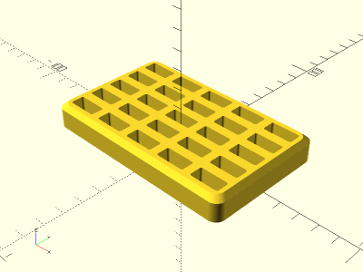

# Parametric 1S LiPo Battery Tray

<table>
<tr>
<td></td>
<td></td>
</tr>
<tr>
<td></td>
<td></td>
</tr>
<tr>
<td></td>
<td></td>
</tr>
</table>

A parametric battery tray for 1S LiPos. Available in standard and narrow battery configurations. Rows, columns, height, and clearances are adjustable parameters. Made with OpenSCAD.

**Design:** [lipo_battery_tray.scad](lipo_battery_tray.scad)

**STLs:**

* [3x3_narrow_lipo_battery_tray.stl](stl/3x3_narrow_lipo_battery_tray.stl)
* [3x3_standard_lipo_battery_tray.stl](stl/3x3_standard_lipo_battery_tray.stl)
* [5x5_narrow_lipo_battery_tray.stl](stl/5x5_narrow_lipo_battery_tray.stl)
* [5x5_standard_lipo_battery_tray.stl](stl/5x5_standard_lipo_battery_tray.stl)

**Recommended Print Settings:** 0.20mm layer height, 15-100% infill, no supports

**Printables**: https://www.printables.com/model/1406552-parametric-1s-lipo-battery-tray

**Thingiverse**: https://www.thingiverse.com/thing:7137582

**License**: 
